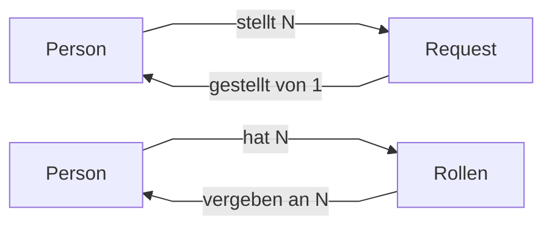

# Projekt: Umzug

## Teil 1: Netzwerk

---
### Anforderungsanalyse

#### Ist-Zustand

- Kleinunternehmen
- 5 MitarbeiterInnen
- Eine Etage
- Netzplan:
  - Router von ISP gestellt
  - Netzadresse 192.168.2.0/24
  - Alle Rechner über einen Switch an Router angebunden
  - Alle Geräte manuell konfiguriert

#### Soll-Zustand

- Zweite Etage wird angemietet
  - Konferenzraum für 30 Personen in der oberen Etage
    - WLAN für externe, ohne Zugriff auf interne Netze
    - WLAN für interne, mit Zugriff auf interne Netze
  - Serverraum in der unteren Etage
  - Druckerraum in beiden Etagen
  - Kabelkanal vorhanden → Vernetzung der Etagen per LAN möglich
- Expansion auf 30 Mitarbeiter geplant, gleichmäßig auf Abteilungen verteilt
  - Redundanz beim Konfigurieren der Netzwerke für die Abteilungen einplanen, um weitere Expansion einfach zu gestalten
- Etagen sollen in jeweils eigenem Netzwerk liegen
  - Zwei Abteilungen pro Etage, jeweils in einem eigenen Netz
  - Ein Netzwerkdrucker pro Etage
- Dynamische Vergabe der IPs an alle Geräte

---
### Netzplan

Basis-Netzadresse: 192.168.2.0 / 24

Folgende Subnetze werden konfiguriert:

| (Sub-)Netzadresse  | IP von        | IP bis        | Anzahl IPs | Anzahl Hosts | Verwendung            |
|--------------------|---------------|---------------|------------|--------------|-----------------------|
| 192.168.2.0 / 27   | 192.168.2.0   | 192.168.2.31  | 32         | 29           | Abteilung 1           |
| 192.168.2.32 / 27  | 192.168.2.32  | 192.168.2.63  | 32         | 29           | Abteilung 2           |
| 192.168.2.64 / 27  | 192.168.2.64  | 192.168.2.95  | 32         | 29           | Abteilung 3           |
| 192.167.2.96 / 27  | 192.168.2.96  | 192.168.2.127 | 32         | 29           | Abteilung 4           |
| 192.168.2.216 / 29 | 192.168.2.216 | 192.168.2.223 | 8          | 5            | Verbindung der Router |
| 192.168.2.224 / 29 | 192.168.2.224 | 192.168.2.231 | 8          | 5            | Druckerraum UG        |
| 192.168.2.232 / 29 | 192.168.2.232 | 192.168.2.239 | 8          | 5            | Serverraum            |
| 192.168.2.240 / 29 | 192.168.2.240 | 192.168.2.247 | 8          | 5            | Druckerraum OG        |
| 192.168.2.248 / 29 | 192.168.2.248 | 192.168.2.255 | 8          | 5            | Konferenzraum         |

<br>

Für den Konferenzraum werden zwei weitere Router benötigt, die mit je einem Access-Point das Gast- bzw. interne Netz aufspannen.

Dafür werden folgende Netze verwendet:

| Netzadresse       | IP von       | IP bis        | Anzahl IPs | Anzahl Hosts | Verwendung      |
|-------------------|--------------|---------------|------------|--------------|-----------------|
| 192.168.3.0 / 26  | 192.168.3.0  | 192.168.3.63  | 64         | 61           | Gastzugang      |
| 192.168.3.64 / 26 | 192.168.3.64 | 192.168.3.127 | 64         | 61           | interner Zugang |

<br>

Folgende Subnetze werden nicht benötigt und können somit in Zukunft verwendet werden, z.B. für weitere Abteilungen:

| (Sub-)Netzadresse  | IP von        | IP bis        | Anzahl IPs | Anzahl Hosts |
|--------------------|---------------|---------------|------------|--------------|
| 192.168.2.128 / 26 | 192.168.2.128 | 192.168.2.191 | 64         | 61           |
| 192.168.2.192 / 28 | 192.168.2.192 | 192.168.2.206 | 16         | 13           |
| 192.168.2.208 / 29 | 192.168.2.208 | 192.168.2.215 | 8          | 5            |
| 192.168.2.216 / 29 | 192.168.2.216 | 192.168.2.223 | 8          | 5            |

---

### Demonstrationsprototyp PaketTracer

Siehe `./Network/Layout.pkt`

<br>

## Teil 2: Datenbank

---

### Anforderungsanalyse

#### Ist-Zustand

- Meisten Informationen werden im Unternehmen digital erfasst, stammen aber aus vielen verschiedenen Quellen (Textverarbeitung, Tabellen, Email, Scan, etc.)

#### Soll-Zustand

- Umstellung auf einheitliches Datenbanksystem
  - Erster Schritt: Benutzerverwaltungssoftware erneuern
    - Erfassen der Mitarbeiterdaten in der Datenbank
    - CRUD (Create, Read, Update, Delete) Funktionalität
    - Export der Daten im JSON Format, zur Weitergabe an den Verzeichnisdienst

---

### Auswahl der Datenbank

#### Aufbau einer relationalen Datenbank

- Sammlung von Tabellen mit Datensätzen ("Zeilen")
- Jede Zeile enthält bestimmte Attribute (Eigenschaften), die die Spalten der Tabelle bilden (z.B ID, Bezeichnung, etc.)
- Verknüpfungen zwischen Tabellen können hergestellt werden, indem ein Attribut aus Tabelle A in Tabelle B übernommen wird und durch Abfragen (z.B mit SQL) abgefragt werden

<br>

#### Fileshared vs. Datenbankserver
| Fileshared                                                                                                                                                                 | Server                                                                                                              |
|----------------------------------------------------------------------------------------------------------------------------------------------------------------------------|---------------------------------------------------------------------------------------------------------------------|
| Datenbank liegt als **eine** Datei auf einer Maschine vor                                                                                                                  | Datenbank wird in mehrere Dateien (z.B. je Tabelle) unterteilt                                                      |
| Änderungen und Abfragen erfolgen durch Sperren der gesamten Datei -> mehrere parallele Verbindungen nicht möglich                                                          | Änderungen und Abfragen werden vom Server abgefangen und optimisiert -> mehrere parallele Verbindungen möglich      |
| Schnell, wenn Datenbank auf eigener Maschine liegt. Langsam, wenn Daten auf einer anderen Maschine liegt, da die ganze Datenbank über das Netzwerk übertragen werden muss. | Abfragen werden auf dem Server ausgewertet und nur das Ergebnis wird übertragen -> geringere Belastung des Netzwerks |

Um zukunfstsicher zu planen entscheiden wir uns für einen MySQL Server, da dieser recht simpel zu verwenden ist und mehrere parallele Verbindungen unterstützt. Somit können ggf. mehrere Admins für die Benutzerverwaltung zuständig sein.

---

### Ermittlung und Beschreibung der notwendigen Daten

#### Quellen der Daten

- User können Rolle anfragen
- Diese werden ebenfalls in der Datenbank hinterlegt und können im Admin-Programm angenomen/abgelehnt werden.
- Admin kann Anfragen annehmen / abnehmen

---

### Entity-Relationship-Modell



<hr>

### Export der Zuweisungen in das JSON Format
Die Rollenzuweisungen aller Personen können via eines Buttons in eine JSON-Datei mit folgendem Format exportiert werden:
```
  {
    "name1" : ["rolle1", "rolle2", ...],
    "name2" : ["rolle1", "rolle2", ...]
  }
```
Da sowohl die Namen der Personen, als auch die Bezeichnungen der Rollen einzigartig sind, kann mit einfachen Strings gearbeitet werden.